<div align="center">

<!-- 3D Animated Hero Header -->


<br/>

# 🏥 ArogyaSeva AI
### *Rural Clinical Decision Support, Multilingual Voice Triage & Emergency Referral Network*

[](./LICENSE)
[](https://reactjs.org/)
[](https://www.typescriptlang.org/)
[](https://tailwindcss.com/)
[](https://www.openstreetmap.org/)
[](https://leafletjs.com/)
[](https://ai.google.dev/)
[]()

<p align="center">
  <b>Bridging the Critical Rural-to-Urban Healthcare Gap</b><br/>
  Empowering Accredited Social Health Activists (ASHAs), Auxillary Nurse Midwives (ANMs), and Community Health Workers (CHWs) with offline-first clinical triage, voice AI diagnostics, live GPS telemetry, and instant hospital dispatch.
</p>

[Explore Features](#-key-capabilities) • [Clinical Pipeline](#-clinical-architecture--pipeline) • [Live Map Engine](#-live-map--overpass-api-engine) • [Quick Start](#-quick-start) • [Author & License](#-author--license)

</div>

---

## 🌟 Overview

In remote rural villages and Primary Health Sub-Centres (PHCs), frontline community health workers face immense challenges: language/dialect barriers, lack of immediate doctor supervision, unreliable internet connectivity, and delayed referral decisions during critical emergencies (e.g., severe hypoxemia, postpartum hemorrhage, acute pediatric distress).

**ArogyaSeva AI** transforms any standard mobile device or tablet into an intelligent clinical workstation:
1. **Multilingual Voice Intake**: Speaks and transcribes colloquial symptoms in **Hindi, Bhojpuri, Bengali, and English** with dialect tolerance.
2. **Offline-First Clinical Risk Engine**: Evaluates red-flag vital signs and danger signs according to **ICMR & WHO ETAT (Emergency Triage Assessment and Treatment)** guidelines without requiring active internet.
3. **Real-Time OpenStreetMap & Overpass Hospital Discovery**: Pinpoints genuine nearby healthcare facilities using live device GPS coordinates, calculating real-world driving times and matching required capabilities (ICU beds, Oxygen, Blood Bank, C-Section OT).
4. **Digital Referral Slip (FHIR & SBAR Compliant)**: Instantly generates verifiable referral slips with QR codes and 1-click **108 Ambulance Dispatch**.
5. **Doctor Emergency Influx Dashboard**: Enables district civil hospital physicians to pre-triage arriving incoming emergencies in real time before the patient arrives at the emergency room.

---

## 🚀 Key Capabilities

### 🎙️ 1. Multi-Lingual Speech & Voice Intake
- Native speech-to-text recognition with support for Indian regional languages and rural colloquial terms (e.g., *"3 din se tez bukhar hai aur saans lene mein takleef ho rahi hai"*).
- Gemini 2.5 Flash clinical entity extraction automatically categorizes symptoms, duration, vitals, and medical history.
- Audio haptic sound feedback and step-by-step guidance for low-literacy field conditions.

### ⚡ 2. Offline-First Clinical Risk Engine
- Deterministic heuristic engine based on **ICMR rural triage protocols** and **WHO Emergency Triage Assessment and Treatment (ETAT)**.
- Real-time physiological score calculation:
  - **SpO2 < 90%** triggers immediate high-flow oxygen protocol and Critical Priority Red.
  - **Systolic BP > 160 mmHg** in pregnancy flags pre-eclampsia danger.
  - **Respiratory Rate > 30 bpm** or stridor triggers respiratory failure alert.
- Operates 100% offline with automatic queue synchronization upon network restoration.

### 🗺️ 3. Live React-Leaflet Map & Overpass API
- Integrated **`react-leaflet`** engine using authentic **OpenStreetMap (OSM)** tiles.
- Queries the live **Overpass API** (`node["amenity"="hospital"]`, `node["amenity"="clinic"]`) based on real-time device GPS coordinates.
- Multi-layer map switcher: **Standard OpenStreetMap**, **CartoDB Light**, and **Satellite Aerial Imagery**.
- Live geodesic trajectory polyline connecting the patient's exact coordinates to the destination hospital with dynamic ETA calculation.

### 📄 4. Verifiable SBAR Referral Slips
- Structured clinical communication format: **S**ituation, **B**ackground, **A**ssessment, **R**ecommendation.
- Pre-filled field stabilization recommendations (e.g., 45° Fowler's position, airway suctioning, IV fluids).
- Cryptographic QR verification for seamless admission at the receiving hospital.
- 1-click **108 Emergency Ambulance Calling** integration.

### 👨‍⚕️ 5. District Doctor Influx Dashboard
- Live queue of referred rural emergencies ranked by clinical acuity score (0–100).
- Incoming patient vitals, GPS distance, estimated time of arrival, and field stabilizing treatments administered.
- One-click bed reservation and emergency OT preparation flags.

---

## 🏗️ Clinical Architecture & Pipeline

```
[ Rural Patient Encounter ]
            │
            ▼
┌─────────────────────────────────────────┐
│   1. Multilingual Voice Intake          │
│   (Hindi, Bhojpuri, Bengali, English)   │
└───────────────────┬─────────────────────┘
                    │
                    ▼
┌─────────────────────────────────────────┐
│   2. Gemini 2.5 Clinical Extractor      │
│   Symptom Parser + Vitals Normalizer    │
└───────────────────┬─────────────────────┘
                    │
                    ▼
┌─────────────────────────────────────────┐
│   3. Offline Rule-Based Triage Engine   │
│   (WHO ETAT & ICMR Red-Flag Algorithms) │
│   Risk Acuity Score: 0 - 100            │
└───────────────────┬─────────────────────┘
                    │
                    ▼
┌─────────────────────────────────────────┐
│   4. Live Overpass GPS Facility Matcher │
│   React-Leaflet + OpenStreetMap         │
│   ICU / O2 / Blood Bank Filter          │
└───────────────────┬─────────────────────┘
                    │
                    ▼
┌─────────────────────────────────────────┐
│   5. Verified SBAR Referral Slip        │
│   108 Ambulance Dispatch + QR Slip      │
└───────────────────┬─────────────────────┘
                    │
                    ▼
┌─────────────────────────────────────────┐
│   6. District Hospital Doctor Dashboard │
│   Pre-Arrival Telemetry & Bed Booking   │
└─────────────────────────────────────────┘
```

---

## 🗺️ Live Map & Overpass API Engine

ArogyaSeva avoids static or simulated maps by interfacing directly with the OpenStreetMap GIS ecosystem:

- **Library**: `react-leaflet` with custom vector markers, animated pulse beacons, and polyline trajectories.
- **Overpass API**: Live query centered on user's real-time coordinates:
  ```overpass
  [out:json][timeout:25];
  (
    node["amenity"="hospital"](around:35000, 28.6139, 77.2090);
    way["amenity"="hospital"](around:35000, 28.6139, 77.2090);
    node["amenity"="clinic"](around:35000, 28.6139, 77.2090);
  );
  out center 25;
  ```
- **Failover Resiliency**: Multi-tier failover (Direct Overpass -> Backend Proxy -> Verified Regional Fallback Cluster) ensures frontline workers never experience map downtime during low-bandwidth conditions.

---

## 💻 Tech Stack

| Domain | Technology | Purpose |
| :--- | :--- | :--- |
| **Frontend** | React 18, TypeScript | High-performance reactive UI |
| **Styling** | Tailwind CSS v4 | Responsive, mobile-first design |
| **Mapping** | `react-leaflet`, `leaflet` | Interactive GIS OpenStreetMap viewer |
| **GIS Data** | OpenStreetMap, Overpass API | Real-time global hospital discovery |
| **AI / NLP** | Google Gemini 2.5 Flash | Multilingual clinical symptom parsing |
| **Backend** | Express, Node.js (TypeScript) | Full-stack proxy, caching & API routes |
| **Audio/Haptics** | Web Audio API | Accessible auditory alerts for field workers |
| **Icons** | Lucide React | Clean, lightweight SVG medical iconography |

---

## 📦 Quick Start

### Prerequisites
- Node.js (v18 or higher)
- npm or bun

### 1. Clone the Repository
```bash
git clone https://github.com/Garv-Shaw/ArogyaSeva.git
cd ArogyaSeva
```

### 2. Install Dependencies
```bash
npm install
```

### 3. Configure Environment Variables
Copy `.env.example` to `.env` and add your Gemini API key:
```bash
cp .env.example .env
```

Edit `.env`:
```env
# Google Gemini API Key for server-side clinical entity parsing
GEMINI_API_KEY=your_gemini_api_key_here
```

### 4. Start Development Server
```bash
npm run dev
```
Open [http://localhost:3000](http://localhost:3000) in your browser to start the app.

### 5. Production Build
```bash
npm run build
npm start
```

---

## 📡 API Endpoints

| Method | Endpoint | Description |
| :--- | :--- | :--- |
| `GET` | `/api/health` | Server status and Gemini API connectivity check |
| `POST` | `/api/gemini/clinical-intake` | Clinical symptom extraction via Gemini 2.5 Flash |
| `GET` | `/api/nearby-hospitals` | Live Overpass API hospital locator proxy with failover |
| `GET` | `/api/cases` | Retrieve active referral cases list |
| `POST` | `/api/cases` | Submit newly triaged referral case from the field |

---

## 📄 Author & License

Developed with ❤️ for rural healthcare workers and frontline medical champions.

- **Author**: Garv Shaw
- **Email**: [garvshaw89@gmail.com](mailto:garvshaw89@gmail.com) • [garvshawinfo@gmail.com](mailto:garvshawinfo@gmail.com)
- **License**: This project is licensed under the **MIT License** - see the [LICENSE](./LICENSE) file for details.
